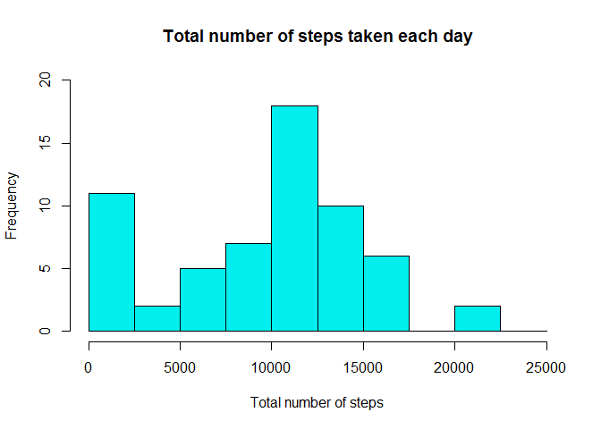
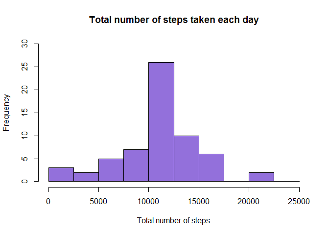
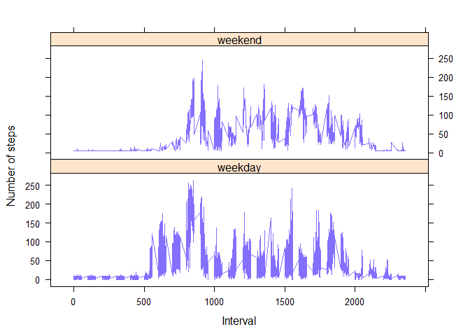

Reproducible Research: Course Project 1
=======================================

### i. Loading and preprocessing the data

Unzip and read the data

    unzip(zipfile="repdata-data-activity.zip")
    activity=read.csv("activity.csv", header=T, sep=",")
    activity$date = as.POSIXct(activity$date, format="%Y-%m-%d")
    activity$steps = as.numeric(activity$steps)   

### ii. What is mean total number of steps taken per day?

Calculate the total number of steps taken per day

    steps = aggregate(activity$steps, by=list(activity$date), FUN=sum, na.rm=TRUE)
    names(steps) = c("date", "totalSteps")

Make a histogram of the total number of steps taken each day

    hist(steps$totalSteps, 
         breaks = seq(from=0, to=25000, by=2500),
         col = "cyan2", 
         xlab = "Total number of steps", 
         ylim = c(0, 20), 
         main = "Total number of steps taken each day"
         )

<!-- -->

Calculate and report the mean and median of the total number of steps
taken per day

    meanSteps = mean(steps$totalSteps)
    medianSteps = median(steps$totalSteps)

    meanSteps

    ## [1] 9354.23

    medianSteps

    ## [1] 10395

### iii. What is the average daily activity pattern?

Make a time series plot of the 5-minute interval and the average number
of steps taken, averaged across all days

    meanInterval = aggregate(activity$steps, 
                           by=list(activity$interval), 
                           FUN=mean, 
                           na.rm=TRUE)

    names(meanInterval) = c("interval", "mean")

    plot(meanInterval$interval, 
         meanInterval$mean, 
         type="l", 
         col="green2", 
         lwd=2, 
         xlab="Interval (min)", 
         ylab="Average of steps", 
         main="Average number of steps per intervals")

<!-- -->

Which 5-minute interval, on average across all the days in the dataset,
contains the maximum number of steps?

    max = which(meanInterval$mean == max(meanInterval$mean))
    maxInterval = meanInterval[max, 1]
    maxInterval

    ## [1] 835

### iv. Imputing missing values

Calculate and report the total number of missing values in the dataset

    totalNAS = sum(is.na(activity$steps))
    totalNAS

    ## [1] 2304

Devise a strategy for filling in all of the missing values in the
dataset. The strategy is going to be remplacing each NA value by the
mean of the steps.

    activityModified = activity
    nas = which(is.na(activityModified$steps))
    means = rep(mean(activityModified$steps, na.rm=TRUE), times=length(nas))

Create a new dataset that is equal to the original dataset but with the
missing data filled in.

    activityModified[nas, "steps"] = means

Make a histogram of the total number of steps taken each day and
Calculate and report the mean and median total number of steps taken per
day. Do these values differ from the estimates from the first part of
the assignment? What is the impact of imputing missing data on the
estimates of the total daily number of steps?

    stepsModified = aggregate(activityModified$steps, by=list(activityModified$date), FUN=sum)
    names(stepsModified) = c("date", "totalSteps")

    hist(stepsModified$totalSteps, 
         breaks=seq(from=0, to=25000, by=2500),
         col = "mediumpurple", 
         xlab = "Total number of steps", 
         ylim = c(0, 30), 
         main = "Total number of steps taken each day")

<!-- -->

    meanStepsModified = mean(stepsModified$totalSteps)
    medianStepsModified = median(stepsModified$totalSteps)

    meanStepsModified

    ## [1] 10766.19

    medianStepsModified

    ## [1] 10766.19

These values highly differ from teh first estimates because When I have
more data I will obtain a bigger mean and a bigger median value

### v. Are there differences in activity patterns between weekdays and weekends?

Create a new factor variable in the dataset with two levels - "weekday"
and "weekend" indicating whether a given date is a weekday or weekend
day.

    activityModified = data.frame(date=activityModified$date, 
                               weekday=tolower(weekdays(activityModified$date)), 
                               steps=activityModified$steps, 
                               interval = activityModified$interval)

    activityModified = cbind(activityModified, 
                          daytype=ifelse(activityModified$weekday == "saturday" | 
                                             activityModified$weekday == "sunday", "weekend", 
                                         "weekday"))

    activityModified = data.frame(date=activityModified$date, 
                           weekday=activityModified$weekday, 
                           daytype=activityModified$daytype, 
                           interval=activityModified$interval,
                           steps=activityModified$steps)

Make a panel plot containing a time series plot of the 5-minute interval
and the average number of steps taken, averaged across all weekday days
or weekend days.

    library(lattice)

    meanActivity = aggregate(activityModified$steps, 
                           by=list(activityModified$daytype, 
                                   activityModified$weekday, activityModified$interval), mean)

    names(meanActivity) = c("daytype", "weekday", "interval", "mean")

        xyplot(mean ~ interval | daytype, meanActivity, 
               type="l", 
               lwd=1, 
               xlab="Interval", 
               ylab="Number of steps", 
               col="lightslateblue",
               layout=c(1,2))

<!-- -->
